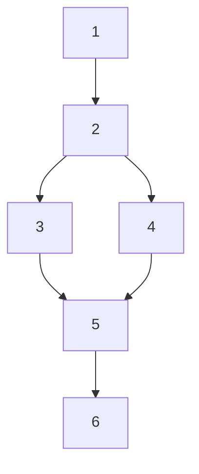

# MVP Orchestrator

## Slug
example-orchestrator

## Project path
/Users/example/projects/example-app

## Summary
A two-page web app: a public landing page and a tiny admin form, backed by a single SQLite table. Illustrative only.

## Longevity
throwaway

## Requirements
- [x] Landing page lists items pulled from the DB.
- [x] Admin form (no auth) creates items.
- [x] Deployable as a single static-host + edge-function bundle.

## Phases
| # | Phase     | File              | Size | Status   | Retries | Depends on |
|---|-----------|-------------------|------|----------|---------|------------|
| 1 | Scaffold  | 01-scaffold.md    | S    | pending  | 0       | —          |
| 2 | Config    | 02-config.md      | S    | pending  | 0       | 1          |
| 3 | Frontend  | 03-frontend.md    | M    | pending  | 0       | 2          |
| 4 | Backend   | 04-backend.md     | M    | pending  | 0       | 2          |
| 5 | Integrate | 05-integrate.md   | M    | pending  | 0       | 3, 4       |
| 6 | Verify    | 06-verify.md      | S    | pending  | 0       | 5          |

## Dependency graph

## Stages
| Stage | Mode     | Phases | Notes                                                                |
|-------|----------|--------|----------------------------------------------------------------------|
| 1     | serial   | [1, 2] | Scaffold then config — must run in order.                            |
| 2     | parallel | [3, 4] | Frontend and backend share no files; safe to launch concurrently.    |
| 3     | serial   | [5, 6] | Integration test then final verify.                                  |

> When the next stage is **parallel** and the user says "next phase" without naming one, the orchestrator must ask: a single phase number, or all phases in the stage? Don't silently pick.

## Model & effort plan
| Phase | Model          | Advisor    |
|-------|----------------|------------|
| 1–2   | Haiku          | no         |
| 3–4   | Sonnet         | no         |
| 5     | Sonnet         | yes (Opus) |
| 6     | Haiku          | no         |

## Stop point
none

## Checkpoint protocol
After each phase:
1. Run acceptance criteria.
2. Update Status + Retries in the table above.
3. Commit code changes in the project repo: `git commit -m "phase N: <name> complete"`.
4. Update registry `updated_at`.
5. On failure: classify, follow Failure protocol (see `/create-mvp` Phase 7).
