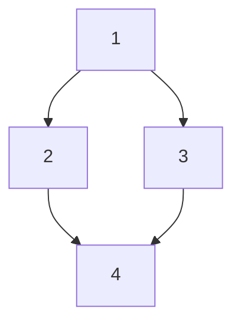

# /create-mvp

You are executing `/create-mvp`. Four modes — **create** (default), **resume** (when `resume` is in `$ARGUMENTS`), **import** (when `import <path>` is in `$ARGUMENTS`), and **export** (when `export` is in `$ARGUMENTS`). Move through the phases in order. Announce each phase on entry (e.g. `── Phase 2: Gap analysis ──`). Do not skip ahead. Do not write implementation code before Phase 6.

Plans live centrally under `MVP_HOME`, where:

```sh
MVP_HOME="${CREATE_MVP_HOME:-${XDG_DATA_HOME:-$HOME/.local/share}/create-mvp}"
```

On macOS/Linux this resolves to `~/.local/share/create-mvp/` by default. Each MVP gets `MVP_HOME/plans/<slug>/`, and the registry lives at `MVP_HOME/registry.json`. Plans are NOT committed to the project — they're process artifacts. Use `MVP_HOME` consistently in any path you read, write, or print to the user.

## Path placeholders

Two placeholders keep plans free of hardcoded absolute paths. Use them in everything you author (orchestrator, phase plans, ADRs, memory); resolve them to real paths only at execution time. Never write a hardcoded absolute path into a plan.

- **`MVP_PROJECT`** — this MVP's slug folder (canonical `MVP_HOME/plans/<slug>/`). Plans reference it symbolically, so no absolute plan path is baked in. Holds the orchestrator, phase plans, `MVP_PROJECT/adrs/`, and `MVP_PROJECT/memory/`. The user may refer to it by name.
- **`PROJECT_ROOT`** — the code repository this MVP builds. It is the **only** absolute path anywhere in the slug folder, written once in the orchestrator's **Project path** field. That field is the single line a developer edits after cloning the repo to a different path. Everything else references `PROJECT_ROOT/…`.

Seed context from the user (may be empty): $ARGUMENTS


---

## Phase 0 — Parse arguments and route

Scan `$ARGUMENTS` for flags:

- `import <path>` → enter **import mode**. The token after `import` is the source — a `.zip` or a directory. Skip directly to Phase 9 (Import) below.
- `export` → enter **export mode**. Skip directly to Phase 10 (Export) below. `verify-only` alongside `export` runs the portability lint without packaging.
- `resume` → enter **resume mode**. Skip directly to Phase 8 (Resume) below.
- `slug=<x>` → resume mode only. Selects a specific MVP from the registry.
- `phase=N` → resume mode only. Jumps to phase N (bypasses dep graph; warn first). If the user wrote "next phase" or similar shorthand and the next stage in the plan is **parallel** with multiple pending phases, do **not** silently pick one — ask whether they mean a specific phase number or all phases in that stage. Only proceed once disambiguated.
- `status` → resume mode only. Show status and exit, no execution.
- `stop-after=plan` → run through Phase 5, then halt before Phase 6. Resume later with `/create-mvp resume`.
- `stop-after=N` (integer) → execute through phase N's acceptance gate, then halt.
- Anything else (in create mode) → treat as free-text seed context.

### Create mode

Record the stop point and announce:

> Stop point set: will halt after planning / after phase N. You can resume with `/create-mvp resume`.

If no stop flag, proceed end-to-end. Continue to Phase 1.

### Resume mode

Announce:

> Resume mode — looking up registered MVPs.

Jump to Phase 8.

### Import mode

Announce:

> Import mode — bringing in a shared MVP.

Jump to Phase 9.

### Export mode

Announce:

> Export mode — verifying and packaging an MVP for sharing.

Jump to Phase 10.


---

## Phase 1 — Requirements (open-ended loop)

Goal: draw out a complete picture of what the user wants built, without proposing solutions.

On entry, tell the user exactly this:

> I'll ask open-ended questions to capture the requirements. When your list feels complete, say **done** and I'll start planning. Otherwise I'll keep asking **"what else?"**.
>
> Heads up: this session can't be resumed until requirements are captured and the orchestrator file is written (end of Phase 4). Stay engaged until then.

### Optional starting point — existing doc

Before the loop, ask exactly:

> Do you have an existing plan, RFC, or PRD I can use as a starting point? Paste one path, or say **none**.

Branch on the answer:

- **none** → skip to the first open-ended question below.
- **Path can't be read** (file missing or unreadable) → tell the user *"Couldn't read that path — continuing without it."* and skip to the first open-ended question.
- **Readable path** →
  1. Read the document.
  2. Extract requirements into the internal running list (same shape the loop produces — group by users/flow/must-haves/constraints/data/integrations where the doc covers them).
  3. Show a concise bulleted summary back to the user, then ask exactly:
     > Is this requirements list complete?
  4. Branch:
     - **No** → enter the open-ended loop with this list as seed context. Rotate only through threads the doc didn't cover. Use the doc-aware entry question below.
     - **Yes** → ask exactly *"To confirm, type `done` to close requirements and move to Phase 2."* The user typing `done` is the normal exit condition (below).

### First open-ended question

Pick the entry question based on what you have so far:

- **No doc provided (or unreadable)** — ask:
  > In one or two sentences, what problem does this MVP solve and who is it for?

- **Doc provided, user said "No" (list incomplete)** — ask:
  > What's missing from the requirements I extracted?

  Only fall back to *"In one or two sentences, what problem does this MVP solve and who is it for?"* if the doc didn't make problem + audience clear.

After each answer, either dig one level deeper on that thread **or** ask **"What else?"**. Rotate through these threads naturally — do NOT recite them as a checklist:

- Users & core job-to-be-done
- End-to-end user flow ("walk me through it from open to aha")
- Must-haves vs nice-to-haves
- Definition of "done enough to ship"
- Constraints: time, budget, team, deployment target
- Data: what's stored, where it comes from, who owns it
- Integrations: third-party services, APIs, auth providers

Rules:
- One question per message in Phase 1. Never batch.
- Never assume. If the user says "it has auth", ask what kind.
- Keep an internal running list. Show it on request.
- If the user contradicts an earlier answer, flag it: *"Earlier you said X — want to revise that?"*
- **Never close the loop yourself.** Even when the list feels comprehensive, your last action before the user says `done` MUST be asking **"What else?"** — give them the explicit chance to add more.

**Acceptable patterns:**
- User answers → you dig deeper on the thread → … → you ask "What else?" → user says `done` → exit.
- User answers → you ask "What else?" → user says `done` → exit.

**Forbidden patterns:**
- Recapping the list and announcing Phase 2 without "What else?" first.
- Treating any reply other than `done` as implicit completion.
- Skipping "What else?" because the list "looks complete".

**Exit condition:** user types `done` *in direct response to a "What else?" prompt*. Never close the loop on your own initiative.


---

## Phase 2 — Gap analysis + longevity check

### 2a. Longevity check (first question in Phase 2)

Ask exactly:

> Quick branching question: is this a **throwaway prototype** (validate an idea, probably toss the code), or do you expect it to **outlive the MVP** (become a real product, onboard others, need to be maintained)?

Record the answer. If **outlive**, you will write ADRs during this phase. If **throwaway**, skip ADRs entirely.

If **outlive**, ask one follow-up to fix the ADR location:

> Where should ADRs live? They help your agent keep context as the MVP progresses.
> 1. **`MVP_PROJECT/adrs/`** (default) — travels with the plan folder, stays out of the repo.
> 2. **`PROJECT_ROOT/adrs/`** — committed alongside the code, becomes a permanent repo artifact.

Record the choice. Default to option 1 (`MVP_PROJECT/adrs/`) if the user has no preference — for an MVP, ADRs are agent context, not yet a product commitment.

### 2b. Gap questions

For each topic below not explicitly covered in Phase 1, ask a targeted question. Batch 2–3 related gaps per message. Accept "skip for MVP" as a valid answer — record it.

- **Stack** — language, framework, runtime, package manager
- **Data layer** — DB, schema approach, migrations
- **Auth** — who authenticates, how (if any)
- **Testing** — unit / integration / e2e, coverage target
- **Documentation** — README, API docs, inline, ADRs
- **Deployment** — local, VPS, serverless, container platform
- **CI/CD** — automated checks, deploy pipeline
- **Error handling & logging**
- **Security basics** — secrets, input validation, CORS, rate limits
- **Performance / scale** — expected load, latency targets
- **Accessibility** (if UI)
- **Observability** — monitoring, metrics, alerts

### 2c. ADRs (only if outlive = true)

As gap answers come in, write a short ADR for each **major** architectural decision — cap at 3–5 total. ADR-worthy: stack choice, data layer choice, auth approach, deployment target, major third-party dependency. Skip operational trivia.

Write each ADR to the location chosen in 2a — `MVP_PROJECT/adrs/NNNN-<slug>.md` by default, or `PROJECT_ROOT/adrs/NNNN-<slug>.md` if the user opted to commit them into the repo:

```markdown
# NNNN: <title>

- **Status:** Accepted
- **Date:** <YYYY-MM-DD>

## Context
<1–3 sentences: why this decision is being made now>

## Decision
<1–2 sentences: what was chosen>

## Alternatives considered
- <option>: <why not>
- <option>: <why not>

## Consequences
<trade-offs accepted; what this locks in or forecloses>
```

When all gaps have explicit answers, proceed to Phase 3.


---

## Phase 3 — Plan sketch (in chat, not files yet)

Draft the plan structure in chat before writing any files. Output:

1. **Phase inventory** — pick from: Scaffold, Data layer, Auth, Core domain, API, UI, Integrations, Testing, Docs, Deploy. Drop what doesn't apply.
2. **One-liner per phase** — objective + key deliverables.
3. **T-shirt size per phase** — S / M / L / XL (sizing rubric below).
4. **Dependency graph** — ASCII or mermaid.
5. **Stages** — group phases into ordered stages. Each stage is either **serial** (its phases run in order) or **parallel** (its phases run concurrently). Stages themselves always run sequentially.
6. **Risk flags** — phases with unknowns that may need a spike.

**Sizing rubric:**
- **S** — mechanical, one file or a tight scaffold. Boilerplate.
- **M** — standard feature implementation, 2–5 files, known patterns.
- **L** — complex domain logic, cross-cutting concerns, or 5+ files.
- **XL** — architecturally tricky, non-obvious design, or heavy integration surface.

End with:

> Does this structure look right? Anything to add, cut, re-order, or re-parent?

Iterate until confirmed. Then proceed.


---

## Phase 4 — Build plan files

Plans go to `$MVP_HOME/plans/<slug>/` — NOT to the project. They're process artifacts, not project artifacts. (`MVP_HOME` is defined in the header; default resolves to `~/.local/share/create-mvp/`.)

### 4a. Resolve project path and pick a slug

Get the absolute project path: run `pwd`. This is `PROJECT_ROOT` — the one absolute path the slug folder records.

Compute a default slug:

```sh
default_slug="$(basename "$PROJECT_ROOT" | tr '[:upper:]' '[:lower:]' | sed 's/[^a-z0-9]/-/g' | sed 's/--*/-/g; s/^-//; s/-$//')-$(printf '%s' "$PROJECT_ROOT" | shasum | cut -c1-6)"
```

Ask the user:

> Pick a slug for this MVP. Used for `$MVP_HOME/plans/<slug>/` and the registry.
> Press enter to use default: **`<default_slug>`**

If the user provides a custom slug:
1. Sanitize: lowercase, replace non-`[a-z0-9-]` with `-`, collapse repeats, trim leading/trailing `-`.
2. If empty after sanitization → fall back to `default_slug`.

If the directory `$MVP_HOME/plans/<slug>/` already exists, ask:

> A plan with slug `<slug>` already exists. Options:
> 1. Overwrite (delete and start fresh)
> 2. Pick another slug
> 3. Resume that one (jump to Phase 8)

Honor the user's choice. Record the final slug. Set `MVP_PROJECT="$MVP_HOME/plans/<slug>"` (resolve `$MVP_HOME` once at this point and use the literal expanded path going forward).

### 4b. Bootstrap directories

```sh
mkdir -p "$MVP_PROJECT/memory"
```

`MVP_PROJECT/memory/` always exists — it's where the agent records code-style and workflow conventions (see 4g). If the longevity check chose the default ADR location, also create it:

```sh
mkdir -p "$MVP_PROJECT/adrs"   # only when outlive=true and ADRs default to MVP_PROJECT
```

The installer should have created `$MVP_HOME/registry.json`, but defensively:

```sh
mkdir -p "$MVP_HOME"
[ -f "$MVP_HOME/registry.json" ] || printf '{\n  "version": 1,\n  "entries": {}\n}\n' > "$MVP_HOME/registry.json"
```

### 4c. Two-pass approach

1. **Sketch pass** — write every phase file as a 5-line stub (objective + placeholder sections).
2. **Fill pass** — expand each stub into the full plan. Go deep.

### 4d. Orchestrator: `MVP_PROJECT/00-orchestrator.md`

```markdown
# MVP Orchestrator

## Slug
<slug>

## Project path
<absolute path captured above>
<!-- This is PROJECT_ROOT — the only absolute path in this folder. Cloned the repo to a different path? Edit this one line and every PROJECT_ROOT reference resolves. -->

## Summary
<one paragraph from Phase 1>

## Longevity
throwaway | outlive

## Requirements
- [ ] <captured requirement>

## Phases
| # | Phase | File | Size | Status | Retries | Depends on |
|---|-------|------|------|--------|---------|------------|
| 1 | Scaffold | 01-scaffold.md | S | pending | 0 | — |
| 2 | Data layer | 02-data.md | M | pending | 0 | 1 |
| 3 | Auth | 03-auth.md | L | pending | 0 | 1 |
| 4 | Core API | 04-api.md | L | pending | 0 | 2, 3 |

## Dependency graph


## Stages
| Stage | Mode     | Phases |
|-------|----------|--------|
| 1     | serial   | [1]    |
| 2     | parallel | [2, 3] |
| 3     | serial   | [4]    |

## Model & effort plan
<filled in Phase 5>

## Stop point
<none | after-plan | after-phase-N>

## Checkpoint protocol
After each phase:
1. Run acceptance criteria.
2. Update Status + Retries in the table (write directly to this file).
3. Commit code changes in the project repo: `git commit -m "phase N: <n> complete"`.
4. Update registry `updated_at`.
5. On failure: classify, follow Failure protocol (Phase 7).
```

Status values: `pending` · `in-progress` · `blocked` · `done`.

Phase file paths are **relative to `MVP_PROJECT`** (not the project). Inside phase plans, reference code with `PROJECT_ROOT/…` and sibling plans with `MVP_PROJECT/…` — never a hardcoded absolute path.

### 4e. Phase plans: `MVP_PROJECT/NN-<slug>.md`

```markdown
# Phase N: <n>

- **Size:** S | M | L | XL
- **Depends on:** <phases>
- **Status:** pending

## Objective
<one paragraph, outcome-focused>

## Inputs
<what must exist from prior phases>

## Deliverables
<concrete files/artifacts this phase produces>

## Task breakdown
- [ ] step 1
- [ ] step 2

## Acceptance criteria
<testable conditions; this is the checkpoint gate>

## Test strategy
<what gets tested at this phase, how>

## Risks & unknowns
<anything that could derail>

## Iteration ceiling
If this phase exceeds ~<N> TodoWrite updates or <M> tool calls without converging on acceptance, pause and surface to user. (Scale to size: S≈10, M≈25, L≈50, XL≈100.)
```

### 4f. Register the MVP

Update `$MVP_HOME/registry.json`. Read the file, parse JSON, add or update the entry under `entries.<slug>`:

```json
"<slug>": {
  "project_path": "<PROJECT_ROOT — absolute project path>",
  "summary": "<one-line summary from Phase 1>",
  "longevity": "<throwaway|outlive>",
  "stop_point": "<none|after-plan|after-phase-N>",
  "created_at": "<ISO 8601 UTC timestamp from `date -u +%Y-%m-%dT%H:%M:%SZ`>",
  "updated_at": "<same as created_at on first write>"
}
```

Use `jq` if available (`jq '.entries["<slug>"] = { ... }' registry.json > tmp && mv tmp registry.json`); otherwise read+modify+write the whole JSON via the Write tool.

Subsequent phase completions only update `updated_at`. Progress is derived live from the orchestrator, so it doesn't need to be cached here.

### 4g. Seed agent memory

`MVP_PROJECT/memory/` is a portable store of **code-style and workflow** facts — conventions the build should follow and that subagents must pick up. It lives in the slug folder so it travels with the plan instead of being tied to a machine-local path.

Format: one fact per file with frontmatter, plus a `MEMORY.md` index. (This mirrors the project-memory convention Claude Code uses; the spec below is self-contained, so any agent that reads this skill can follow it.)

```markdown
---
name: <short-kebab-case-slug>
description: <one-line summary — used to decide relevance during recall>
metadata:
  type: project | reference | feedback
---

<the fact. For workflow/style conventions, state the rule and a one-line why. Link related memories with [[their-name]].>
```

Seed `MVP_PROJECT/memory/MEMORY.md` as the index (one line per fact, `- [Title](file.md) — hook`):

```markdown
# Memory

Code-style and workflow conventions for this MVP. One fact per file; this index lists them.
```

During the build, whenever a convention is decided or discovered (formatter, naming, test layout, commit style, a workflow rule the user gave), write it here as a memory file and add its index line — so every subagent inherits it. Reference these files with `MVP_PROJECT/memory/…`.

### 4h. Announce

After all files are written, list them and announce:

> Orchestrator, phase plans, and `memory/` written to `MVP_PROJECT` — this MVP is now resumable via `/create-mvp resume`.
> Slug: `<slug>`. Registered.

Then ask for approval before Phase 5.


---

## Phase 5 — Build preparation

Present all five items, then wait for **"go"**. If `stop-after=plan`, halt at the end of this phase and tell the user how to resume.

### 5a. Permissions to pre-approve

Minimal wildcard set for the chosen stack. Prefer narrow wildcards over `Bash(*)`. Example for Node + Postgres:

```
Bash(npm:*), Bash(npx:*), Bash(node:*), Bash(git:*),
Bash(mkdir:*), Bash(ls:*), Bash(cat:*), Bash(echo:*),
Bash(psql:*), Bash(docker:*),
Read(**), Write(**), Edit(**)
```

Tell the user to add these via `/permissions`.

### 5b. Model mapping (driven by t-shirt size)

| Size | Model | Rationale |
|------|-------|-----------|
| S | Haiku | Mechanical, cheap, fast |
| M | Sonnet | Standard implementation sweet spot |
| L | Sonnet + Opus advisor at gate | Cheap bulk, smart review |
| XL | Opus | Architectural weight justifies cost |

**Advisor pattern:** only on L/XL, spin up a short-lived Opus subagent to review the phase's deliverables against its acceptance criteria before marking `done`. Cheap insurance.

### 5c. Execution strategy

- **Task** tool launches parallel subagents — one per phase in the current parallel stage, each given its phase plan file path (`MVP_PROJECT/NN-...md`, resolved to an absolute path at dispatch).
- **TodoWrite** inside each phase tracks sub-tasks against the iteration ceiling.
- Batch file reads/edits in single messages.
- Commit after every phase (in the project repo, not the plan dir).
- Run full test suite + lint at the end.

### 5d. Summary table

```
Phase  Size  Model          Stage         Advisor
1      S     Haiku          1 (serial)    no
2      M     Sonnet         2 (parallel)  no
3      L     Sonnet         2 (parallel)  yes (Opus)
4      L     Sonnet         3 (serial)    yes (Opus)
```

### 5e. Git initialisation check

Run `git rev-parse --is-inside-work-tree` in the project directory to check if the project is a git repository.

- **Already a repo** → continue.
- **Not a repo** → tell the user:
  > This project isn't a git repository. The build relies on per-phase commits as checkpoints. Initialise it now? (yes / no)

  - **yes** → run `git init`, then `git add . && git commit -m "init: pre-MVP baseline"`.
  - **no** → warn that per-phase checkpointing will fail. Confirm the user wants to proceed without git, then continue.

If `stop-after=plan`:

> Plan complete. Run `/create-mvp resume` to execute from Phase 6.

Otherwise wait for **"go"**.


---

## Phase 6 — Execute

1. Orchestrator: phase 1 → `in-progress`.
2. Execute phase 1 inline (scaffold rarely parallelizes).
3. Run acceptance criteria → on pass: commit, mark `done`. On fail: **Failure protocol** (Phase 7).
4. For each subsequent stage (in order):
   - **Serial stage** → execute its phases one at a time, in declared order, applying steps 2–3 to each.
   - **Parallel stage** → if the user said "next phase" without naming one, confirm scope first (single phase number vs. all phases in this stage). Then launch one **Task** subagent per in-scope phase (model per 5b), input = phase plan file path (`MVP_PROJECT/NN-...md`, resolved to its absolute path). Wait for all.
   - Launch **advisor subagent** (Opus) per completed phase to verify acceptance criteria.
   - Update orchestrator. Update registry `updated_at`. Commit code changes in the project repo.
5. Honor stop point: if `stop-after=N` and phase N just finished, halt and announce resume instructions.
6. Continue until every phase is `done`.
7. Final pass: full test suite, README update, one-page summary of what was built + deferred follow-ups.

---

## Phase 7 — Failure protocol (classified + bounded)

When a phase misses acceptance, first **classify the failure**, then apply the matching loop. Increment `Retries` in the orchestrator on every retry. Append a one-line note under the phase describing the failure + class.

### Class 1 — TEST_OR_LINT
Automated check failed (pytest, eslint, tsc, etc.). Mechanical.
- **Action:** 1 auto-retry, same plan. Dispatch the same subagent with the failing output as input.
- **If still failing:** escalate to user.

### Class 2 — ACCEPTANCE_MISS (logic)
Code runs, tests pass, but acceptance criteria not met. Logic/design wrong.
- **Action:** 1 auto-replan of *this phase only* (rewrite its task breakdown, keep its objective), then re-execute. Advisor subagent reviews the replan before execution.
- **If still failing:** escalate to user.

### Class 3 — REQUIREMENTS_GAP
Execution revealed the requirements themselves are wrong, contradictory, or incomplete.
- **Action:** always escalate. No auto-loop. Pause, surface the gap, offer: update Phase 1 requirements → regenerate affected phase files → resume.

### Hard ceilings (protects the "cheap" goal)
- Max 2 total auto-retries per phase across all classes. After that, escalate regardless of class.
- If a phase hits its iteration ceiling (from the phase plan), treat as implicit failure and classify.

### If requirements change mid-build

Pause. Classify as REQUIREMENTS_GAP. Identify affected phase files in `MVP_PROJECT`. Update them. Re-confirm with the user. Resume.


---

## Phase 8 — Resume an in-progress MVP

Reached only when `resume` was in `$ARGUMENTS` (Phase 0 routes here). Never start from scratch in this branch — if no MVP is found, halt and tell the user to run `/create-mvp` (without `resume`).

### 8a. Discover via registry

Read `$MVP_HOME/registry.json` (`MVP_HOME` is defined in the header). If it doesn't exist or has zero entries, **self-heal before giving up** — the registry is a rebuildable cache; the orchestrators are the source of truth. Scan `$MVP_HOME/plans/*/00-orchestrator.md`:

- **One or more found** → ask:
  > Registry is empty but I found <N> plan folder(s) on disk: <slugs>. Rebuild the registry from them? (yes / no)

  On **yes** → for each, run the **Register an MVP from its orchestrator** routine (below), then continue with the rebuilt registry. On **no** → show the "no in-progress MVP" message below and stop.
- **None found** →

  > No in-progress MVP found. You must complete requirements first — run `/create-mvp` (without `resume`) and stay engaged at least through Phase 4, when the orchestrator file is written. Until then there's nothing to resume. (To bring in a folder shared from elsewhere, use `/create-mvp import <path>`.)

  Stop.

For each entry, verify `$MVP_HOME/plans/<slug>/00-orchestrator.md` exists. Auto-prune entries whose orchestrator is missing — surface a one-line note for each pruned, and rewrite the registry.

### 8b. Selection

Decision order:

1. **`slug=<x>` arg** → look up `entries.<x>`. If missing, error and list available slugs. Otherwise select.
2. **CWD auto-pick** → run `pwd`. If exactly one entry has `project_path` matching CWD → auto-select. Announce:
   > Resuming `<slug>` (matched current directory) — <summary>.
3. **Picker** → if multiple entries match CWD (corrupted) or zero match: show 8c picker.

### 8c. Picker

Show a compact table. Read each orchestrator just enough to extract progress:

```
# Slug                 Project                     Summary               Progress    Updated
1 todo-app-x7f3a       /Users/.../todo-app         Todo app with teams   3/6 done    2d ago
2 metrics-tool-b1e2    /Users/.../metrics          Internal metrics      1/8 done    1h ago
```

Ask:

> Which MVP? (number, or `all` for full phase tables)

Wait for selection. If `all`, expand each with its phase table, then re-ask.

### 8d. Load selected MVP

Set `MVP_PROJECT="$MVP_HOME/plans/<slug>"`. Read `MVP_PROJECT/00-orchestrator.md`. Parse:

- Slug, project path (the **Project path** field — this is `PROJECT_ROOT`)
- Summary, longevity
- Requirements
- Phase table (status, retries, size, deps)
- Dependency graph
- Stages (and per-stage mode: serial / parallel)
- Stop point
- Model & effort plan (if present — means planning is complete)

### Sanity checks

- Any phase `in-progress` → warn: *"Phase N was left in-progress. Likely a prior interrupted run. Mark `pending` and redo, or `done` if the work actually completed?"* — require user answer before proceeding.
- Any phase `blocked` → surface block reason and require user decision: retry, revise plan, or skip.
- If Model & effort plan section is empty → planning never finished. Route to **8f. Planning resume** below.

### 8e. Show status and propose next action

Print a concise status block:

```
MVP: <summary>
Slug: <slug>
Project: <project_path>
Longevity: throwaway | outlive
Progress: X/Y phases done
Blocked: <list or none>
Next pending phase(s): <numbers from the first group with all deps met>
Requested stop point: <from args, or none>
```

If `status` arg was passed: stop here. Do not execute.

Otherwise propose the plan:

> I'll execute phases <list> next<, stopping after phase N | before Phase 6 if stop-after=plan>. Proceed? (yes / adjust)

Wait for confirmation.

### 8f. Planning resume (only if planning was incomplete)

If the orchestrator exists but has no Model & effort plan section, the previous run stopped during planning. Resume inside the create flow at the right point:

- No phase plan files in `MVP_PROJECT` beyond the orchestrator → jump to Phase 4 (build plan files).
- Phase plans exist but no Model & effort section → jump to Phase 5.

Honor `stop-after=plan` here too.

When planning finishes, continue to 8g.

### 8g. Execute remaining phases

Follow Phase 6 exactly, with these resume-specific rules:

#### 8g-i. Starting point
Begin with the first stage whose every phase is `pending` **and** whose dependencies are all `done`. Skip phases already `done`. If that stage is parallel and the user said "next phase" without naming one, confirm scope (single phase vs. whole stage) before launching.

#### 8g-ii. Stop-point honor
- `stop-after=plan` → only meaningful if 8f ran. Halt at the end of Phase 5 — same halt point Phase 5 honors for `stop-after=plan`.
- `stop-after=N` → when phase N is marked `done`, halt. Print:
  > Halted after phase N as requested. Run `/create-mvp resume` again to continue.
- No `stop-after` → run to completion.

#### 8g-iii. Phase jump (`phase=N`)
If set and user confirmed the warning in Phase 0:
- Verify dependencies of phase N are all `done`. If not, refuse and explain which deps are missing.
- Execute only phase N. Do not auto-advance.
- Update orchestrator. Update registry `updated_at`. Halt.

#### 8g-iv. Failure protocol
Same as Phase 7 — classified (TEST_OR_LINT / ACCEPTANCE_MISS / REQUIREMENTS_GAP), bounded (max 2 auto-retries per phase), with advisor subagent review.

### 8h. Close out

When the run halts (either at stop point or because all phases are `done`):

1. Update orchestrator: statuses, retries, any new blocks.
2. Update registry: `updated_at`.
3. Commit project code: `git commit -m "resume: <summary of what ran>"`.
4. Print a compact summary:
   ```
   Ran this session: phases <list>
   Now done: X/Y
   Still pending: <list>
   Blocked: <list or none>
   Next resume command: /create-mvp resume <suggested args>
   ```

If all phases are `done`, also run the final pass from Phase 6, step 7: full test suite, README update, one-page summary.

---

## Register an MVP from its orchestrator (shared routine)

Reconstructs a registry entry from a plan folder's orchestrator. The orchestrator is the source of truth; the registry is a derived index. Used by import (Phase 9) and by 8a's registry self-heal.

Given a slug folder at `$MVP_HOME/plans/<slug>/`:

1. Read `$MVP_HOME/plans/<slug>/00-orchestrator.md`. If it's missing, skip with a note: `<slug> has no orchestrator — not a valid plan folder`.
2. Parse: **Project path** → `project_path`, **Summary** → `summary`, **Longevity** → `longevity`, **Stop point** → `stop_point`.
3. Timestamps: `updated_at = now` (`date -u +%Y-%m-%dT%H:%M:%SZ`). Preserve `created_at` if the entry already exists; otherwise set it equal to `updated_at`.
4. Write the entry under `entries.<slug>` in `$MVP_HOME/registry.json` — same shape and method as Phase 4f (jq, else read-modify-write via the Write tool).

---

## Phase 9 — Import a shared MVP

Reached only when `import <path>` was in `$ARGUMENTS` (Phase 0 routes here). Brings a plan folder produced on another machine into this machine's `$MVP_HOME` and registers it so it can be resumed. **Never executes build phases** — it ends by pointing the user at `/create-mvp resume`.

### 9a. Resolve the source

`<path>` is the token after `import`. It may be:

- a `.zip` → extract into a temp directory (`unzip -q <path> -d <tmp>`).
- a directory → use in place.

Locate the plan-folder root: the directory that directly contains `00-orchestrator.md` (if the archive wraps everything in a single top-level `<slug>/`, descend into it). If no `00-orchestrator.md` is found anywhere under the source:

> No orchestrator found under `<path>` — that's not a `/create-mvp` plan folder.

Stop.

### 9b. Determine the slug

Read the orchestrator's **Slug** field; sanitize (lowercase, non-`[a-z0-9-]`→`-`, collapse repeats, trim). Fall back to the source folder's basename if the field is missing or empty after sanitizing.

### 9c. Collision check

If `$MVP_HOME/plans/<slug>/` already exists:

> A plan with slug `<slug>` already exists here. Options:
> 1. Overwrite (replace the existing folder)
> 2. Import under a new slug
> 3. Cancel

Honor the choice. On overwrite, remove the existing folder first.

### 9d. Place the folder

```sh
mkdir -p "$MVP_HOME/plans"
cp -R "<resolved-source-root>/." "$MVP_HOME/plans/<slug>/"
```

Remove the temp extraction directory if one was used.

### 9e. Reconcile PROJECT_ROOT

The orchestrator's **Project path** (`PROJECT_ROOT`) points at wherever the repo lived on the *origin* machine. Show it and offer to fix it:

> This MVP was built against `PROJECT_ROOT = <path from orchestrator>`. Where does the repo live on *this* machine?
> - Press enter to keep that path.
> - Or paste the local path.

If the user supplies a new path, rewrite the single **Project path** line in `$MVP_HOME/plans/<slug>/00-orchestrator.md`. Whether kept or changed, if the final path doesn't exist on disk, warn (don't block):

> Note: `<path>` doesn't exist yet — clone the repo there or fix the Project path before executing.

### 9f. Register

Run the **Register an MVP from its orchestrator** routine (above) for `<slug>`.

### 9g. Done

> [imported] `<slug>` — placed at `$MVP_HOME/plans/<slug>/` and registered. Run `/create-mvp resume` to continue.

Stop. Do not auto-execute.

---

## Phase 10 — Export a shared MVP

Reached only when `export` was in `$ARGUMENTS` (Phase 0 routes here). Packages a plan folder into a portable archive for sharing — and **first verifies it's portable**: the only hardcoded absolute path allowed anywhere in the folder is the orchestrator's single **Project path** line; everything else must reference `MVP_PROJECT` / `PROJECT_ROOT`. The counterpart to import (Phase 9). Never executes build phases.

### 10a. Select the MVP

Pick the MVP using the same rules as 8a–8c: a `slug=<x>` arg, else CWD auto-pick against `project_path`, else the picker. Set `MVP_PROJECT="$MVP_HOME/plans/<slug>"`.

### 10b. Verify the symbols (portability lint)

Read the orchestrator. Let `P` = its **Project path** value (the `PROJECT_ROOT` definition) and `D` = the resolved `MVP_PROJECT` path. Scan every file under `MVP_PROJECT/` — orchestrator, phase plans, `adrs/`, `memory/` — for hardcoded paths that should be placeholders:

- Any occurrence of the literal `P` **except** the one on the orchestrator's Project path line (that one is allowed — it defines `PROJECT_ROOT`).
- Any occurrence of the literal `D`.
- Other absolute-path markers: `$HOME`, `~/`, `/Users/`, `/home/`, and the resolved `MVP_HOME`.

Report each hit as `file:line` with the offending text. If hits exist, offer to fix:

> Found <N> hardcoded path(s) that should be placeholders. Rewrite them? (`PROJECT_ROOT` for the repo path, `MVP_PROJECT` for the plan dir) — yes / show / cancel

- **yes** → replace literal `P` → `PROJECT_ROOT` (everywhere but the Project path line) and literal `D` → `MVP_PROJECT`, then re-scan.
- A leak that is neither `P` nor `D` (some unrelated absolute path) can't be auto-rewritten — list it and require the user to fix it manually or explicitly confirm exporting anyway.

A clean scan (or an explicit confirm-anyway) is required before packaging.

**`verify-only`:** if that flag is present, stop here — print a pass/fail summary (clean, or the list of leaks) and do **not** package.

### 10c. Package

```sh
out_dir="<out= arg, default: current directory>"
( cd "$MVP_HOME/plans" && zip -qr "$out_dir/<slug>.zip" "<slug>" )
```

Zipping from `$MVP_HOME/plans` keeps `<slug>/00-orchestrator.md` as the archive's top-level wrapper — exactly what import (9a) expects.

### 10d. Done

> [exported] `<slug>` → `<out_dir>/<slug>.zip` (portability verified). Share it; the recipient runs `/create-mvp import <slug>.zip`.

Stop.


---

## Vocabulary

- **phase** — the atomic unit of execution. Phases 0–10 are the canonical phases of `/create-mvp` itself; user MVPs also break work into numbered phases (`01-scaffold.md`, `02-data.md`, etc.). A phase is never split or merged at runtime.
- **stage** — an ordered group of phases. A stage runs as **serial** (its phases execute in order, one at a time) or **parallel** (its phases launch concurrently). Stages always run sequentially relative to one another.
- "Next phase" is ambiguous when the upcoming stage is parallel — see Phase 0 / Phase 6 for the verification rule.
- **`MVP_PROJECT`** — this MVP's slug folder (canonical `MVP_HOME/plans/<slug>/`). Holds the orchestrator, phase plans, `adrs/`, `memory/`. Use the token in plans; never its expanded path.
- **`PROJECT_ROOT`** — the code repository. The only absolute path in the slug folder, defined once in the orchestrator's **Project path** field. Use the token everywhere else.

## Principles

- Checkpoints > speed. Update the orchestrator religiously.
- Parallel when the graph allows; serial when it doesn't.
- Every phase has an acceptance gate. No gate, no `done`.
- Subagents are cheap — use them for both building and reviewing.
- Auto-loops have ceilings. The goal is fast *and* cheap — not infinite retries.
- Resume always shows status first; never execute without confirmation.
- Respect the dependency graph. `phase=N` is a conscious override, not a default.
- Orchestrator is the source of truth. Trust its statuses over assumptions.
- Stop points matter. If the user said "stop after 3", stop after 3 — don't overshoot because "we're so close".
- Plans live in `$MVP_HOME/plans/<slug>/` (default `~/.local/share/create-mvp/plans/<slug>/`), NOT in the project. Plans are process, not artifact.
- Plans carry no hardcoded absolute paths. They reference `MVP_PROJECT/…` and `PROJECT_ROOT/…`. The one absolute path is the orchestrator's **Project path**; that line is all a dev edits after cloning the repo to a different path.
- ADRs (when written) default to `MVP_PROJECT/adrs/` — for an MVP they're agent context, not yet a product commitment. Commit them into the repo's `adrs/` only if the user opts in. Throwaways skip ADRs.
- `MVP_PROJECT/memory/` carries code-style and workflow conventions in the agent's native memory format, relocated so it travels with the plan. Write conventions there so every subagent inherits them.

