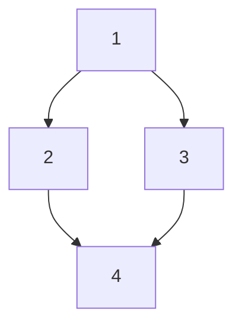

## Phase 4 — Build plan files

Plans go to `$MVP_HOME/plans/<slug>/` — NOT to the project. They're process artifacts, not project artifacts. (`MVP_HOME` is defined in the header; default resolves to `~/.local/share/create-mvp/`.)

### 4a. Resolve project path and pick a slug

Get the absolute project path: run `pwd`. This is `PROJECT_ROOT` — the one absolute path the slug folder records.

Compute a default slug:

```sh
default_slug="$(basename "$PROJECT_ROOT" | tr '[:upper:]' '[:lower:]' | sed 's/[^a-z0-9]/-/g' | sed 's/--*/-/g; s/^-//; s/-$//')-$(printf '%s' "$PROJECT_ROOT" | shasum | cut -c1-6)"
```

Ask the user:

> Pick a slug for this MVP. Used for `$MVP_HOME/plans/<slug>/` and the registry.
> Press enter to use default: **`<default_slug>`**

If the user provides a custom slug:
1. Sanitize: lowercase, replace non-`[a-z0-9-]` with `-`, collapse repeats, trim leading/trailing `-`.
2. If empty after sanitization → fall back to `default_slug`.

If the directory `$MVP_HOME/plans/<slug>/` already exists, ask:

> A plan with slug `<slug>` already exists. Options:
> 1. Overwrite (delete and start fresh)
> 2. Pick another slug
> 3. Resume that one (jump to Phase 8)

Honor the user's choice. Record the final slug. Set `MVP_PROJECT="$MVP_HOME/plans/<slug>"` (resolve `$MVP_HOME` once at this point and use the literal expanded path going forward).

### 4b. Bootstrap directories

```sh
mkdir -p "$MVP_PROJECT/memory"
```

`MVP_PROJECT/memory/` always exists — it's where the agent records code-style and workflow conventions (see 4g). If the longevity check chose the default ADR location, also create it:

```sh
mkdir -p "$MVP_PROJECT/adrs"   # only when outlive=true and ADRs default to MVP_PROJECT
```

The installer should have created `$MVP_HOME/registry.json`, but defensively:

```sh
mkdir -p "$MVP_HOME"
[ -f "$MVP_HOME/registry.json" ] || printf '{\n  "version": 1,\n  "entries": {}\n}\n' > "$MVP_HOME/registry.json"
```

### 4c. Two-pass approach

1. **Sketch pass** — write every phase file as a 5-line stub (objective + placeholder sections).
2. **Fill pass** — expand each stub into the full plan. Go deep.

### 4d. Orchestrator: `MVP_PROJECT/00-orchestrator.md`

```markdown
# MVP Orchestrator

## Slug
<slug>

## Project path
<absolute path captured above>
<!-- This is PROJECT_ROOT — the only absolute path in this folder. Cloned the repo to a different path? Edit this one line and every PROJECT_ROOT reference resolves. -->

## Summary
<one paragraph from Phase 1>

## Longevity
throwaway | outlive

## Requirements
- [ ] <captured requirement>

## Phases
| # | Phase | File | Size | Status | Retries | Depends on |
|---|-------|------|------|--------|---------|------------|
| 1 | Scaffold | 01-scaffold.md | S | pending | 0 | — |
| 2 | Data layer | 02-data.md | M | pending | 0 | 1 |
| 3 | Auth | 03-auth.md | L | pending | 0 | 1 |
| 4 | Core API | 04-api.md | L | pending | 0 | 2, 3 |

## Dependency graph


## Stages
| Stage | Mode     | Phases |
|-------|----------|--------|
| 1     | serial   | [1]    |
| 2     | parallel | [2, 3] |
| 3     | serial   | [4]    |

## Model & effort plan
<filled in Phase 5>

## Stop point
<none | after-plan | after-phase-N>

## Checkpoint protocol
After each phase:
1. Run acceptance criteria.
2. Update Status + Retries in the table (write directly to this file).
3. Commit code changes in the project repo: `git commit -m "phase N: <n> complete"`.
4. Update registry `updated_at`.
5. On failure: classify, follow Failure protocol (Phase 7).
```

Status values: `pending` · `in-progress` · `blocked` · `done`.

Phase file paths are **relative to `MVP_PROJECT`** (not the project). Inside phase plans, reference code with `PROJECT_ROOT/…` and sibling plans with `MVP_PROJECT/…` — never a hardcoded absolute path.

### 4e. Phase plans: `MVP_PROJECT/NN-<slug>.md`

```markdown
# Phase N: <n>

- **Size:** S | M | L | XL
- **Depends on:** <phases>
- **Status:** pending

## Objective
<one paragraph, outcome-focused>

## Inputs
<what must exist from prior phases>

## Deliverables
<concrete files/artifacts this phase produces>

## Task breakdown
- [ ] step 1
- [ ] step 2

## Acceptance criteria
<testable conditions; this is the checkpoint gate>

## Test strategy
<what gets tested at this phase, how>

## Risks & unknowns
<anything that could derail>

## Iteration ceiling
If this phase exceeds ~<N> TodoWrite updates or <M> tool calls without converging on acceptance, pause and surface to user. (Scale to size: S≈10, M≈25, L≈50, XL≈100.)
```

### 4f. Register the MVP

Update `$MVP_HOME/registry.json`. Read the file, parse JSON, add or update the entry under `entries.<slug>`:

```json
"<slug>": {
  "project_path": "<PROJECT_ROOT — absolute project path>",
  "summary": "<one-line summary from Phase 1>",
  "longevity": "<throwaway|outlive>",
  "stop_point": "<none|after-plan|after-phase-N>",
  "created_at": "<ISO 8601 UTC timestamp from `date -u +%Y-%m-%dT%H:%M:%SZ`>",
  "updated_at": "<same as created_at on first write>"
}
```

Use `jq` if available (`jq '.entries["<slug>"] = { ... }' registry.json > tmp && mv tmp registry.json`); otherwise read+modify+write the whole JSON via the Write tool.

Subsequent phase completions only update `updated_at`. Progress is derived live from the orchestrator, so it doesn't need to be cached here.

### 4g. Seed agent memory

`MVP_PROJECT/memory/` is a portable store of **code-style and workflow** facts — conventions the build should follow and that subagents must pick up. It lives in the slug folder so it travels with the plan instead of being tied to a machine-local path.

Format: one fact per file with frontmatter, plus a `MEMORY.md` index. (This mirrors the project-memory convention Claude Code uses; the spec below is self-contained, so any agent that reads this skill can follow it.)

```markdown
---
name: <short-kebab-case-slug>
description: <one-line summary — used to decide relevance during recall>
metadata:
  type: project | reference | feedback
---

<the fact. For workflow/style conventions, state the rule and a one-line why. Link related memories with [[their-name]].>
```

Seed `MVP_PROJECT/memory/MEMORY.md` as the index (one line per fact, `- [Title](file.md) — hook`):

```markdown
# Memory

Code-style and workflow conventions for this MVP. One fact per file; this index lists them.
```

During the build, whenever a convention is decided or discovered (formatter, naming, test layout, commit style, a workflow rule the user gave), write it here as a memory file and add its index line — so every subagent inherits it. Reference these files with `MVP_PROJECT/memory/…`.

### 4h. Announce

After all files are written, list them and announce:

> Orchestrator, phase plans, and `memory/` written to `MVP_PROJECT` — this MVP is now resumable via `/create-mvp resume`.
> Slug: `<slug>`. Registered.

Then ask for approval before Phase 5.
